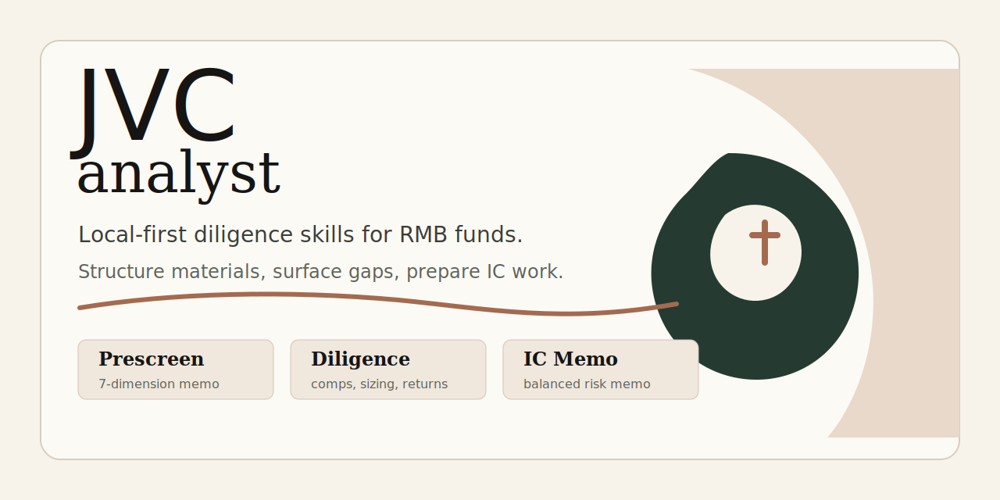

# jvc-analyst

<p align="center">
  
</p>

<p align="center">
  <a href="#安装"></a>
  <a href="#工具总览"></a>
  <a href="#使用原则"></a>
  <a href="#维护检查"></a>
</p>

`jvc-analyst` 是一个本地优先的早期 VC 尽调工具箱，面向中国市场人民币基金的 Pre-seed 到 Series B 项目。

它不是自动化流水线，也不替人做投资决策。它负责把材料结构化、暴露证据缺口、准备问题，并把访谈纪要、竞品表、市场规模、回报模型、IC memo 和报销归档放进同一个可安装的 skill 集合。

## 适合谁

- 面向中国市场、人民币基金、Pre-seed 到 Series B 项目的投资人和研究协作者。
- 需要把 deck、访谈、公开资料、竞品、市场规模和投资回报放进同一套本地工作流的人。
- 希望 AI 帮忙整理证据和问题，但不希望 AI 自动替代判断、建档和投决的人。

## 品牌与 PR 素材

仓库内置一组 GitHub 友好的 SVG 素材，可直接用于 README、仓库 Social preview、PR 描述或项目介绍页。

| 素材 | 文件 | 用途 |
| --- | --- | --- |
| 签名字体 JVC 标识 | `assets/brand/jvc-signature-logo.svg` | 项目标识、页眉、PR 开头 |
| GitHub README hero | `assets/brand/github-hero.svg` | README 顶部横幅 |
| Social preview | `assets/brand/social-preview.svg` | GitHub 仓库社交预览图 |

视觉方向：签名字体感的 `JVC` 主标，搭配克制的编辑型 serif 标题、温暖纸色背景、墨黑正文和少量赤陶/墨绿强调。它借鉴 Claude 官网那种安静、留白、可信的字体气质，但不复刻 Anthropic/Claude 的品牌资产。

## 安装

```bash
git clone https://github.com/justinjia0813/jvc-analyst.git
cd jvc-analyst
./setup
```

`setup` 会自动检测本机已有的 AI 编码平台，将 `skills/jvc-*` 注册到对应目录：

| 平台 | 目录 |
| --- | --- |
| Claude Code | `~/.claude/skills/` |
| Codex | `~/.codex/skills/` |
| Agents | `.agents/skills/` |
| OpenClaw | `.openclaw/skills/` |
| Hermes | `.hermes/skills/` |
| Cursor | `.cursor/skills/` |

安装完成后即可在对话中通过 `/jvc-prescreen`、`/jvc-bear-case` 等 slash command 调用。

## 使用原则

- 每个 skill 独立调用，按需取用；建档、归档、推进节奏和最终决策由用户自己把控。
- 原始项目材料保持本地存放，默认放在 `projects/{company-slug}/00-source/`。
- 输出必须区分事实、受访者自述、用户观察、推测和未验证假设。
- 公开资料可以联网检索；不要把 BP、逐字稿、财务表、创始人沟通记录上传到第三方网页工具。

## 工具总览

| Skill | 什么时候用 | 输出 |
| --- | --- | --- |
| `/jvc-prescreen` | 给项目素材，快速过核心问题，生成结构化初筛纪要。 | Markdown |
| `/jvc-bull-case` | 从项目素材中提炼投资亮点和待验证项。 | Markdown |
| `/jvc-bear-case` | 用挑剔 LP、竞品 CEO、怀疑论同行、IC boss 四个角色做反向论证。 | Markdown |
| `/jvc-track-research` | 给细分赛道，构建产业知识图谱。 | Markdown |
| `/jvc-comps-dd` | 调研竞争对手、可比公司、上下游和海外标杆。 | Excel |
| `/jvc-market-sizing` | 针对细分赛道做 TAM/SAM/SOM 建模和正交检查。 | Excel |
| `/jvc-roi-modeler` | 基于投资条款、融资稀释和退出假设计算 MOIC/IRR。 | Excel |
| `/jvc-ic-memo` | 汇总所有前序素材，合成十段式 IC memo 初稿。 | Markdown |
| `/jvc-meeting-notes` | 把逐字稿和用户笔记整理成结构化 Word 访谈纪要。 | DOCX |
| `/jvc-talk-notes` | 把高管访谈、客户访谈和专家访谈整理成问答式 Word 纪要。 | DOCX |
| `/jvc-invoice-manager` | OCR 识别 PDF 发票，生成报销汇总 Excel，并归档 PDF。 | Excel + PDF archive |

外部前置能力：`/asr` 仍视为本地转写能力，用于音频/视频到逐字稿。

## 各 Skill 说明

完整 prompt 和约束见 `skills/jvc-*/SKILL.md`。这里保留日常使用时需要的速查摘要。

### `/jvc-prescreen` 初筛

- 输入：deck 或项目素材。
- 做什么：按市场、痛点、方案、团队、时机、商业模式、显性风险 7 个维度过一遍。
- 输出：事实摘要、各维度判断、bear case 雏形、关键问题清单。

### `/jvc-bull-case` 投资亮点

- 输入：deck、prescreen、访谈纪要、公开资料。
- 做什么：从行业趋势、技术节点、团队优势、商业化进展四个层面提炼亮点。
- 输出：每条亮点附论据和待验证项，可迁入 IC memo。

### `/jvc-bear-case` 反向论证

- 输入：项目分析材料。
- 做什么：扮演挑剔 LP、竞品 CEO、怀疑论同行、IC boss 四种角色找茬。
- 输出：至少 4 条反对论点，每条附可证伪条件。

### `/jvc-track-research` 产业知识图谱

- 输入：细分赛道名称。
- 做什么：联网搜索，输出行业定义、行业简史、技术路线、产业链、政策/技术/市场趋势、关键玩家、监管和投资问题。
- 输出：结构化 Markdown，可衔接 `/jvc-comps-dd` 和 `/jvc-market-sizing`。

### `/jvc-comps-dd` 竞品尽调

- 输入：目标项目或赛道。
- 做什么：搜集上市公司和初创公司，按直接竞品、可比、上下游、海外标杆分类。
- 输出：Excel，包含 `companies`、`segmentation`、`sources`、`coverage_notes`。

### `/jvc-market-sizing` 市场规模建模

- 输入：细分赛道定义、地域、客群、场景。
- 做什么：同时建 Top-Down 和 Bottom-Up 两套模型，做正交性检查和对账。
- 输出：Excel，包含 `assumptions`、`top_down`、`bottom_up`、`reconciliation`、`orthogonality_check`、`sources`。

### `/jvc-roi-modeler` 投资回报模型

- 输入：投资条款、财务预测、后续融资假设、退出假设。
- 做什么：逐轮计算稀释，建立三情形退出，输出 MOIC/IRR 和敏感性分析。
- 输出：Excel，包含 `investment_terms`、`financial_forecast`、`financing_dilution`、`ownership`、`exit_scenarios`、`returns`、`sensitivity`、`sources`。

### `/jvc-ic-memo` 投决备忘录

- 输入：所有前序素材和用户的核心投资逻辑。
- 做什么：按交易摘要、公司、市场、产品、团队、财务、投资逻辑、风险、估值、待决事项十段结构合成 memo 初稿。
- 输出：完整 Markdown 初稿，风险篇幅不短于投资逻辑篇幅。

### `/jvc-meeting-notes` 访谈纪要

- 输入：AI 转写逐字稿、用户随笔、会议日期、线上/线下、项目名称。
- 做什么：融合逐字稿与随笔，按六段式结构生成 Word 访谈纪要。
- 输出：`.docx` 文件，命名为 `{YYYYMMDD}_{项目名称}_访谈纪要.docx`。
- 来源：已整合自 `meeting-notes` repo，脚本和中性默认模板位于 `skills/jvc-meeting-notes/`。

### `/jvc-talk-notes` 问答式访谈纪要

- 输入：高管访谈、客户访谈、专家访谈逐字稿，用户随笔，会议日期，受访人角色。
- 做什么：按一问一答制整理问题、回答摘要、对应事实层维度、关键原话、事实标签、待验证点，并在末尾生成事实层索引。
- 输出：`.docx` 文件，命名为 `{YYYYMMDD}_{项目名称}_{受访人角色}_问答纪要.docx`。
- 来源：复用 `skills/jvc-meeting-notes/` 下的 Word 生成脚本和模板解析逻辑。

## Word 模板定制

`jvc-meeting-notes` 和 `jvc-talk-notes` 不绑定任何基金或机构的 Word 模板。仓库内默认模板是中性公开模板，公众用户可以用自己的 `.docx` 模板覆盖。

模板解析顺序：

1. 命令行参数：`--template path/to/template.docx`
2. 环境变量：`JVC_DOCX_TEMPLATE=/path/to/template.docx`
3. 本地放置：`skills/jvc-meeting-notes/templates/custom.docx`
4. 默认模板：`skills/jvc-meeting-notes/templates/访谈纪要模板.docx`

生成器会从模板中保留页面设置、样式、页眉和页脚，清空正文占位内容后写入新的纪要正文。如果模板里有示例段落，脚本会按前几个非空段落抽取标题、章节、正文和子标题样式；如果没有示例段落，则使用模板的 `Normal` 样式。`templates/custom.docx` 已被 `.gitignore` 忽略，适合放用户自己的机构模板，不会误提交到 public repo。

示例：

```bash
python3 skills/jvc-meeting-notes/scripts/generate_meeting_notes.py data.json \
  --template ~/Documents/my-firm-template.docx \
  --output output/20260612_项目名称_访谈纪要.docx
```

### `/jvc-invoice-manager` 发票整理

- 输入：PDF 发票目录、用户确认后的费用信息、归属项目、报销人、月份。
- 做什么：OCR 识别发票，复核后生成报销汇总 Excel，并按行程归档 PDF。
- 输出：`archive/{YYYY-MM}_报销汇总.xlsx` 与行程 PDF 归档目录。
- 来源：已整合自 `invoice-manager` repo，脚本和模板位于 `skills/jvc-invoice-manager/`。

## 项目档案目录约定

建档由用户自己控制。推荐结构如下，skill 产出物归档位置已标出：

```text
projects/{company-slug}/
├── 00-source/              # 只读区：deck、财务表、转写、/jvc-meeting-notes 或 /jvc-talk-notes .docx
├── 01-prescreen.md         # ← /jvc-prescreen
├── 02-dd-notes.md          # 用户自己的尽调笔记
├── 03-founder-sync.md      # 用户自己的访谈笔记
├── 04-bull-case.md         # ← /jvc-bull-case
├── 04-bear-case.md         # ← /jvc-bear-case
├── 05-comps-dd.xlsx        # ← /jvc-comps-dd
├── 05-market-sizing.xlsx   # ← /jvc-market-sizing
├── 05-roi-modeler.xlsx     # ← /jvc-roi-modeler
├── 06-ic-memo.md           # ← /jvc-ic-memo
└── 99-decision.md          # 用户自己的最终决策

tracks/{track-slug}/
├── landscape.md            # ← /jvc-track-research
├── comps-dd.xlsx           # ← /jvc-comps-dd
└── market-sizing.xlsx      # ← /jvc-market-sizing
```

## 仓库结构

```text
.
├── assets/
│   └── brand/
│       ├── github-hero.svg
│       ├── jvc-signature-logo.svg
│       └── social-preview.svg
├── CLAUDE.md
├── README.md
├── examples/
├── library/
│   └── skill-registry.md
├── scripts/
│   ├── check-jvc-assets.sh
│   ├── check-talk-notes-assets.sh
│   ├── check-docx-template-customization.py
│   ├── check-excel-workbooks.sh
│   ├── generate-workbook.py
│   └── validate-workbook.py
├── skills/
│   ├── jvc-bear-case/
│   ├── jvc-bull-case/
│   ├── jvc-comps-dd/
│   ├── jvc-ic-memo/
│   ├── jvc-invoice-manager/
│   ├── jvc-market-sizing/
│   ├── jvc-meeting-notes/
│   ├── jvc-prescreen/
│   ├── jvc-roi-modeler/
│   ├── jvc-talk-notes/
│   └── jvc-track-research/
├── templates/
└── setup
```

## 维护检查

```bash
bash scripts/check-jvc-assets.sh
bash scripts/check-talk-notes-assets.sh
python3 scripts/check-docx-template-customization.py
bash scripts/check-excel-workbooks.sh
```
