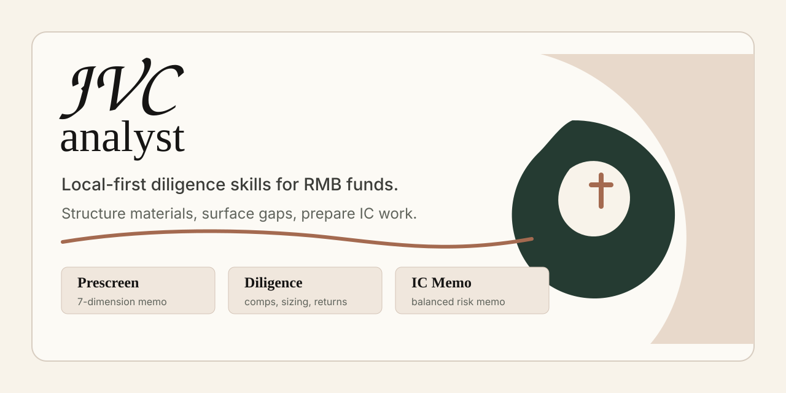

# jvc-analyst

<p align="center">
  
</p>

<p align="center">
  <a href="#安装"></a>
  <a href="#工具总览"></a>
  <a href="#使用原则"></a>
  <a href="#维护检查"></a>
</p>

`jvc-analyst` 是一个本地优先的早期 VC 尽调工具箱，面向中国市场人民币基金的 Pre-seed 到 Series B 项目。

它不是自动化流水线，也不替人做投资决策。它负责把材料结构化、暴露证据缺口、准备问题，并把访谈纪要、竞品表、市场规模、回报模型、IC（Investment Committee，投资决策委员会，负责审议投资项目）memo 和报销归档放进同一个可安装的 skill 集合。需要跨阶段推进时，可选择 `/jvc-deal-flow` 作为薄编排层；单项任务仍直接调用原子 Skill。

3.0 新增按研究级别裁剪的规格体系：快筛不背流程负担，进入尽调后再逐步增加假设、任务、证据和决策日志。

## 适合谁

- 面向中国市场、人民币基金、Pre-seed 到 Series B 项目的投资人和研究协作者。
- 需要把 deck、访谈、公开资料、竞品、市场规模和投资回报放进同一套本地工作流的人。
- 希望 AI 帮忙整理证据和问题，但不希望 AI 自动替代判断、建档和投决的人。

## 品牌与 PR 素材

仓库内置一组 GitHub 友好的 SVG 素材，可直接用于 README、仓库 Social preview、PR 描述或项目介绍页。

| 素材 | 文件 | 用途 |
| --- | --- | --- |
| 签名字体 JVC 标识 | `assets/brand/jvc-signature-logo.svg` | 项目标识、页眉、PR 开头 |
| GitHub README hero | `assets/brand/github-hero.svg` | README 顶部横幅 |
| Social preview | `assets/brand/social-preview.svg` | GitHub 仓库社交预览图 |

视觉方向：签名字体感的 `JVC` 主标，搭配克制的编辑型 serif 标题、温暖纸色背景、墨黑正文和少量赤陶/墨绿强调。它借鉴 Claude 官网那种安静、留白、可信的字体气质，但不复刻 Anthropic/Claude 的品牌资产。

## 安装

```bash
git clone <repo-url>
cd jvc-analyst
./setup
```

`setup` 会自动检测本机已有的 AI 编码平台，将 `skills/jvc-*` 注册到对应目录。安装包包含 `14 user skills + 1 hidden research core`；隐藏的 `jvc-research-core` 只为研究 skill 提供本地证据台账与审查，不提供 slash command。

| 平台 | 目录 |
| --- | --- |
| Claude Code | `~/.claude/skills/` |
| Codex | `~/.codex/skills/` |
| Agents | `.agents/skills/` |
| OpenClaw | `.openclaw/skills/` |
| Hermes | `.hermes/skills/` |
| Cursor | `.cursor/skills/` |

安装完成后即可在对话中通过 `/jvc-prescreen`、`/jvc-bear-case` 等 slash command 调用。

### 研究 core

已接入的研究 skill 会按需调用四个固定命令：

```bash
python3 "<core>/scripts/researchctl.py" init --skill "<skill>" --run-dir "<run-dir>" --scope-file "<scope.json>"
python3 "<core>/scripts/researchctl.py" record --run-dir "<run-dir>" --input "<records.jsonl>"
python3 "<core>/scripts/researchctl.py" audit --run-dir "<run-dir>" --skill "<skill>" --artifact "<artifact>"
python3 "<core>/scripts/researchctl.py" waive --run-dir "<run-dir>" --skill "<skill>" --rule "<rule>" --reason "<reason>" --scope "<scope>" --approved-by "<person>" --residual-risk "<risk>"
```

审查状态只有 `ready`、`partial`、`blocked`：只有 `ready` 可以声称研究完成；`partial` 必须标注不完整并缩小结论；`blocked` 只交付证据缺口和下一步。公开资料搜索仍由代理使用平台搜索工具完成，包内脚本没有网络代码。

## 使用原则

- 每个原子 Skill 都可独立调用，按需取用；只有用户明确选择受编排项目模式时才使用 `/jvc-deal-flow`。建档、归档、推进节奏和最终决策仍由用户自己把控。
- 原始项目材料保持本地存放，默认放在 `projects/{company-slug}/00-source/`。
- 输出必须区分事实、受访者自述、用户观察、推测和未验证假设。
- 公开资料可以联网检索；不要把 BP、逐字稿、财务表、创始人沟通记录上传到第三方网页工具。

### 研究级别

L0–L3（Research Level 0–3，研究级别 0–3，用于按决策场景控制流程密度）采用逐级增加工件的方式：

| 级别 | 什么时候用 | 额外工件上限 |
| --- | --- | --- |
| **L0 快筛** | 30 分钟看 deck | 无；只产出 `01-prescreen.md` |
| **L1 初筛** | 决定是否见创始人 | `spec/CONTEXT.md` + `spec/research-plan.md` + `spec/hypotheses.md` |
| **L2 尽调** | 首面后验证关键假设 | + `spec/tasks.md` + `STATE.md` + 轻量 `evidence/` + Bull/Bear Case |
| **L3 重仓/领投** | 提交投资决策委员会前 | + 完整证据卡片 + `decision-journal.md` |

级别决定流程密度，不改变来源标注、反面证据、保密和不替人决策的纪律。每个 Skill 在自己的 `SKILL.md` 中声明最低适用级别。

## 工具总览

这套工具按控制与引擎、赛道级、项目级、输出级、日常工具五类组织。本轮 P1（Priority 1，优先级 1，表示第一迁移优先项）已完成赛道研究、知识树和市场模型的活跃合同迁移；P2（Priority 2，优先级 2，表示第二迁移优先项）已完成 Comps/DD 的 Markdown 迁移与 Research Report 的“组装 + 发布”两阶段。叙事研究默认使用 Markdown，公式模型默认使用 CSV（Comma-Separated Values，逗号分隔值，一种纯文本表格格式）；需要固定版式、办公协作或发布时，才使用 PDF（Portable Document Format，可移植文档格式，用于固定版式）、HTML（HyperText Markup Language，超文本标记语言，用于浏览器预览）、DOCX（Office Open XML Document，Office 开放 XML 文档，用于可编辑文字处理）或 Excel 等例外格式。

### 控制与引擎

| Skill | 什么时候用 | 输出 |
| --- | --- | --- |
| `/jvc-deal-flow` | 唯一项目总控；仅在用户选择受编排模式后，维护项目身份、状态、依赖、最小调度、增量重跑和人工闸门。 | `project_events.jsonl` + `STATE.md` + `CHANGELOG.md` + `PROJECTS.md` + 阶段工件 |
| `jvc-research-core` | 不可直接调用的证据引擎；只由已接入的研究 Skill 调用，维护证据台账、主张继承和产物审计，不推进业务阶段。 | `evidence_registry.jsonl` + `audit.json` + `audit.md` |

### 赛道级工具

| Skill | 什么时候用 | 输出 |
| --- | --- | --- |
| `/jvc-track-research` | 给细分赛道，构建产业知识图谱，并将活跃产物固定写入 `tracks/{track-slug}/landscape.md`。 | `tracks/{track-slug}/landscape.md` |
| `/jvc-knowledge-tree-builder` | 读取已有本地赛道资料，生成 visual-first（视觉优先，先用图和树展示结构）的固定五文件知识包。 | `knowledge_tree.md` + `knowledge_graph.mmd` + `nodes.json` + `evidence_index.md` + `open_questions.md` |
| `/jvc-market-sizing` | 针对细分赛道做 TAM（Total Addressable Market，总潜在市场，表示理论总需求）、SAM（Serviceable Available Market，可服务市场，表示能力与范围内可覆盖需求）和 SOM（Serviceable Obtainable Market，可获得市场，表示现实可获取份额）建模和正交检查。 | 固定单表 `market-sizing.csv` |

### 项目级工具

| Skill | 什么时候用 | 输出 |
| --- | --- | --- |
| `/jvc-prescreen` | 在 Research Level 0（L0，研究级别 0，指约 30–60 分钟的资源筛选）完成商业模式、上下游、赛道有效性、Top-down 市场、五年收入和交易回报快筛；结论是研究资源判断，非最终投决。 | 固定输出 `01-prescreen.md` |
| `/jvc-bull-case` | 从项目素材中提炼投资亮点和待验证项。 | Markdown |
| `/jvc-bear-case` | 用挑剔有限合伙人、竞品公司负责人、怀疑论同行、IC boss 四个角色做反向论证。 | Markdown |
| `/jvc-comps-dd` | 调研竞争对手、可比公司、上下游和海外标杆，保留来源、覆盖缺口和反向检索。 | 固定输出 `03-comps-dd.md` |
| `/jvc-meeting-notes` | 把逐字稿和用户笔记整理成结构化 Word 访谈纪要。 | DOCX |
| `/jvc-talk-notes` | 把高管访谈、客户访谈和专家访谈整理成问答式 Word 纪要。 | DOCX |
| `/jvc-roi-modeler` | 基于投资条款、融资稀释和退出假设计算投入资本倍数与内部收益率。 | CSV |

### 输出级工具

| Skill | 什么时候用 | 输出 |
| --- | --- | --- |
| `/jvc-ic-memo` | 汇总前序素材形成十七章预审版；用户批准预审后生成干净终版。 | `06-ic-memo-review.md` + `06-ic-memo.md` |
| `/jvc-research-report` | 把已审计的赛道级上游（Track Research、Knowledge Tree、Market Sizing、可选 Comps/DD）组装为 canonical `research-report.md`，再校验并渲染为 PDF 与 HTML；不新增事实、不联网补研究。 | `research-report.md` + 渲染结果（`report.pdf`、`report.html`、`build-report.txt`） |

### 日常工具

| Skill | 什么时候用 | 输出 |
| --- | --- | --- |
| `/jvc-invoice-manager` | Optical Character Recognition（OCR，光学字符识别，用于从发票图像提取文字）处理 PDF 发票，生成报销汇总 Excel，并归档 PDF。 | Excel + PDF archive |

外部前置能力：`/asr` 仍视为本地转写能力，用于音频/视频到逐字稿。

## 各 Skill 说明

完整 prompt 和约束见 `skills/jvc-*/SKILL.md`。这里保留日常使用时需要的速查摘要。

### `/jvc-deal-flow` 项目工作流编排

- 输入：项目名、本地项目库、来源路径、当前阶段、目标阶段和停止点。
- 做什么：维护不可变项目身份与追加式事件链，从事件生成状态/改动/项目库视图，并按假设缺口调用最少的现有原子 Skill。
- 输出：`.jvc/project_events.jsonl`、`STATE.md`、`CHANGELOG.md`、`PROJECTS.md`，以及当前阶段需要的 Data Layer、Invest Memo 或 Insight Layer。
- 边界：不把全部 Skill 捆成固定流水线；研究级别升级、进入尽调、接受尽调发现、提交投决、最终决定、关闭和归档均保留人工批准。

CLI（Command-Line Interface，命令行界面，用于在终端调用状态脚本）只提供 `init`、`event`、`check`、`list` 四个命令；调用方不得直接编辑事件链。

### `/jvc-prescreen` 初筛

- 输入：deck、项目素材，以及可选的融资、估值、持股和经营预测口径。
- 做什么：在 L0 梳理商业模式、上下游与价值分配、赛道有效性，以 Top-down（自上而下，指从有来源的上位市场逐层收窄）粗算市场区间，并形成五年收入和交易回报情景；缺关键数据时只保留公式、条件与待验证项。
- 输出：固定的 `01-prescreen.md`，包含可见来源、公式、单位、假设和置信度。
- 边界：不初始化 Research Core，不创建更高研究级别工件；只判断是否继续投入研究资源，非最终投决。

### `/jvc-bull-case` 投资亮点

- 输入：deck、prescreen、访谈纪要、公开资料。
- 做什么：从行业趋势、技术节点、团队优势、商业化进展四个层面提炼亮点。
- 输出：每条亮点附论据和待验证项，可迁入 IC memo。

### `/jvc-bear-case` 反向论证

- 输入：项目分析材料。
- 做什么：扮演挑剔有限合伙人、竞品公司负责人、怀疑论同行、IC boss 四种角色找茬。
- 输出：至少 4 条反对论点，每条附可证伪条件。

### `/jvc-track-research` 产业知识图谱

- 输入：细分赛道名称。
- 做什么：联网搜索，输出行业定义、行业简史、技术路线、产业链、政策/技术/市场趋势、关键玩家、监管和投资问题。
- 输出：固定写入 `tracks/{track-slug}/landscape.md`，并可衔接 `/jvc-knowledge-tree-builder` 和 `/jvc-market-sizing`。

### `/jvc-research-report` 研报组装与发布（两阶段）

- 输入：已审计的赛道级上游产物——`tracks/{track-slug}/landscape.md`、Knowledge Tree 五文件包或 `knowledge_tree.md`、`market-sizing.csv`、可选 `03-comps-dd.md`；或用户已完成的完整 canonical `research-report.md`（直接发布）。
- 阶段一 组装：按 `references/output-contract.md` 的上游到章节映射重组 `research-report.md`，保留来源标识、继承上游主张、列出覆盖缺口；运行只读 `validate_assembly.py` 校验来源、数字与标签继承。禁止联网补研究、禁止新增事实数字。
- 阶段二 发布：校验固定章节、来源、本地图片与样式后，调用 `build_report.py` 渲染 `report.pdf`、`report.html` 和 `build-report.txt`；直接发布模式信任用户对 canonical 的声明。
- 前置：将 `SKILL_ROOT` 设为包含该 skill 的 `SKILL.md` 的绝对目录，运行 `python3 -m pip install -r "$SKILL_ROOT/requirements.txt"`，并确保 Fontconfig（字体配置系统，用于查询和验证本机字体）的 `fc-match`、`fc-query`、`fc-scan` 可用。`./setup` 只注册 skill，不安装这些依赖。
- 输出：`research-report.md`（canonical）、`report.pdf`、`report.html` 和 `build-report.txt`。
- 边界：只重组经审查的内容；上游缺失时在覆盖缺口章节显式列出，不调用网页搜索补齐。

CLI（Command-Line Interface，命令行界面，用于在终端调用构建器）示例（直接发布模式，canonical 已存在）；先替换三个绝对路径占位符，未传自定义品牌时仍显式指向内置 `brand.yml`：

```bash
SKILL_ROOT="/absolute/path/to/jvc-research-report"
REPORT="/absolute/path/to/research-report.md"
OUTPUT="/absolute/path/to/output"
python3 "$SKILL_ROOT/scripts/build_report.py" "$REPORT" \
  --brand "$SKILL_ROOT/assets/brand.yml" \
  --output "$OUTPUT"
```

### `/jvc-knowledge-tree-builder` 知识树构建

- 输入：已有本地赛道、项目、Obsidian 或来源文件夹。
- 做什么：读取文件夹资料，以 visual-first 方式整理成递归问题树、关系图、结构化节点、证据索引和开放问题。
- 输出：固定五文件知识包 `knowledge_tree.md`、`knowledge_graph.mmd`、`nodes.json`、`evidence_index.md`、`open_questions.md`；其中 `knowledge_tree.md` 是主入口。
- 校验：运行 `validate_output.py` 校验五文件包，运行 `check_package.py` 做包级自检。
- 边界：不是第一轮联网赛道研究；新赛道开题先用 `/jvc-track-research`。

### `/jvc-comps-dd` 竞品尽调

- 输入：目标项目或赛道。
- 做什么：搜集上市公司和初创公司，按直接竞品、可比、上下游、海外标杆分类。
- 输出：固定 Markdown 文件 `03-comps-dd.md`，包含范围与口径、公司分层、可比指标、目标与可比公司对照、上下游、海外标杆、来源索引、覆盖缺口和下一步尽调动作。

### `/jvc-market-sizing` 市场规模建模

- 输入：细分赛道定义、地域、客群、场景。
- 做什么：同时建 Top-Down 和 Bottom-Up 两套模型，做正交性检查和对账。
- 输出：唯一活跃模型为固定单表 `market-sizing.csv`，包含 `assumptions`、`top_down`、`bottom_up`、`reconciliation`、`orthogonality_check`、`sources`。
- 校验：运行 `validate_csv.py` 校验单表合同，运行 `check_package.py` 做包级自检。

### `/jvc-roi-modeler` 投资回报模型

- 输入：投资条款、财务预测、后续融资假设、退出假设。
- 做什么：按用户母版逐轮计算稀释，建立三情形退出，勾稽公司估值、持股价值、退出总回款、净收益、投入资本倍数、累计收益率和内部收益率。
- 输出：单表 CSV，固定保留年度预测、三种退出情景、来源列和可审计公式。

### `/jvc-ic-memo` 投决备忘录

- 输入：所有前序素材和用户的核心投资逻辑。
- 做什么：先生成含引用、证据状态、冲突和质量报告的十七章预审版；用户明确预审通过后，再生成不含审查痕迹、供 IC（Investment Committee，投资决策委员会，负责审议投资项目）阅读和 Quarto 渲染的干净 Markdown 终版。
- 人工闸门：先生成并审查 `06-ic-memo-review.md`；只有用户明确批准预审后，才生成并校验 `06-ic-memo.md`。
- 输出：`06-ic-memo-review.md`（含引用、证据状态、冲突和质量报告）与 `06-ic-memo.md`（用户批准后的干净终版）。

### `/jvc-meeting-notes` 访谈纪要

- 输入：AI 转写逐字稿、用户随笔、会议日期、线上/线下、项目名称。
- 做什么：融合逐字稿与随笔，按六段式结构生成 Word 访谈纪要。
- 输出：`.docx` 文件，命名为 `【YYYY年MM月DD日访谈】{访谈对象}.docx`。
- 来源：已整合自 `meeting-notes` repo，脚本和中性默认模板位于 `skills/jvc-meeting-notes/`。

### `/jvc-talk-notes` 问答式访谈纪要

- 输入：高管访谈、客户访谈、专家访谈逐字稿，用户随笔，会议日期，受访人角色。
- 做什么：按一问一答制整理问题标题、完整回答、对应事实层维度和待验证点；完整回答需保留核心信息、筛去重复和无信息量 ad-libs，并在末尾生成事实层索引。
- 输出：`.docx` 文件，命名为 `【YYYY年MM月DD日访谈】{访谈对象}.docx`。
- 来源：复用 `skills/jvc-meeting-notes/` 下的 Word 生成脚本和模板解析逻辑。

## Word 模板定制

`jvc-meeting-notes` 和 `jvc-talk-notes` 不绑定任何基金或机构的 Word 模板。仓库内默认模板是中性公开模板，公众用户可以用自己的 `.docx` 模板覆盖。

默认模板采用内置 meeting-notes 标准版式：A4 页面，页边距为上/下 2.54cm、左/右 3.17cm；标题居中 18pt 加粗；章节标题 10pt 加粗；正文和问答小标题 10pt 常规；段前/段后 0、单倍行距；正文两端对齐，并启用 `doNotExpandShiftReturn` 避免手动换行短行被强行拉满；段落使用 `Normal` 并通过 run 级字体格式呈现，保证 `/jvc-meeting-notes` 和 `/jvc-talk-notes` 视觉一致，只改变文字编排结构。

模板解析顺序：

1. 命令行参数：`--template path/to/template.docx`
2. 环境变量：`JVC_DOCX_TEMPLATE=/path/to/template.docx`
3. 本地放置：`skills/jvc-meeting-notes/templates/custom.docx`
4. 默认模板：`skills/jvc-meeting-notes/templates/访谈纪要模板.docx`

生成器会从模板中保留页面设置、样式、页眉和页脚，清空正文占位内容后写入新的纪要正文。如果模板里有示例段落，脚本会按前几个非空段落抽取标题、章节、正文和子标题样式；如果模板只提供 `Normal` 样式，则按默认 meeting-notes 标准直接写入标题、章节、正文和子标题的字体格式。`templates/custom.docx` 已被 `.gitignore` 忽略，适合放用户自己的机构模板，不会误提交到 public repo。

示例：

```bash
python3 skills/jvc-meeting-notes/scripts/generate_meeting_notes.py data.json \
  --template ~/Documents/my-firm-template.docx \
  --output output
```

### `/jvc-invoice-manager` 发票整理

- 输入：PDF 发票目录、用户确认后的费用信息、归属项目、报销人、月份。
- 做什么：OCR 识别发票，复核后生成报销汇总 Excel，并按行程归档 PDF。
- 输出：`archive/{YYYY-MM}_报销汇总.xlsx` 与行程 PDF 归档目录。
- 来源：已整合自 `invoice-manager` repo，脚本和模板位于 `skills/jvc-invoice-manager/`。

## 项目档案目录约定

建档由用户自己控制。推荐结构如下，skill 产出物归档位置已标出：

```text
projects/{company-slug}/
├── .jvc/
│   └── project_events.jsonl   # /jvc-deal-flow 受编排项目的追加式事件源
├── 00-source/                  # 只读区：deck、财务表、转写和原始访谈材料
├── spec/                       # L1+ 研究规格内核
│   ├── CONTEXT.md              # L1+；共享语言、判断标准和已关闭决策
│   ├── research-plan.md        # L1+；范围和验收标准
│   ├── hypotheses.md           # L1+；3–5 条可证伪核心假设
│   └── tasks.md                # L2+；验证任务、依赖和完成标准
├── STATE.md                    # L2+；受编排项目在 L0/L1 也可作为运行元数据
├── CHANGELOG.md                # /jvc-deal-flow 从事件链生成的改动视图
├── DATA_LAYER.md               # /jvc-deal-flow 的事实层
├── INVEST_MEMO.md              # /jvc-deal-flow 的尽调前工作备忘录
├── INSIGHT_LAYER.md            # /jvc-deal-flow 的已验证论点层
├── decision-journal.md         # L3 决策时；立案与结果回填
├── evidence/                   # L2+；来源材料与 motive_check
│   ├── customer-interviews/
│   ├── market-reports/
│   ├── competitive-intel/
│   └── financial-data/
├── 01-prescreen.md             # ← /jvc-prescreen
├── 02-dd-notes.md              # 用户自己的尽调笔记
├── 03-founder-sync.md          # 用户自己的访谈笔记
├── 04-bull-case.md             # ← /jvc-bull-case
├── 04-bear-case.md             # ← /jvc-bear-case
├── 03-comps-dd.md              # ← /jvc-comps-dd
├── market-sizing.csv           # ← /jvc-market-sizing
├── 05-roi-modeler.csv          # ← /jvc-roi-modeler
├── 06-ic-memo-review.md        # ← /jvc-ic-memo 预审版
├── 06-ic-memo.md               # ← /jvc-ic-memo
└── 99-decision.md              # 用户自己的最终决策

tracks/{track-slug}/
├── landscape.md            # ← /jvc-track-research
├── research-report.md      # ← /jvc-research-report canonical（组装产物）
├── report.pdf              # ← /jvc-research-report 渲染
├── report.html             # ← /jvc-research-report 渲染
├── build-report.txt        # ← /jvc-research-report 渲染
├── knowledge_tree.md       # ← /jvc-knowledge-tree-builder
├── knowledge_graph.mmd     # ← /jvc-knowledge-tree-builder
├── nodes.json              # ← /jvc-knowledge-tree-builder
├── evidence_index.md       # ← /jvc-knowledge-tree-builder
├── open_questions.md       # ← /jvc-knowledge-tree-builder
├── 03-comps-dd.md          # ← /jvc-comps-dd
└── market-sizing.csv       # ← /jvc-market-sizing
```

### 旧项目迁移

旧项目无需整体搬家，也不要修改 `00-source/`。继续保留已有编号文件；项目升级到 L1 时再从 `templates/project-context-template.md` 和 `templates/hypotheses-template.md` 复制两个文件到 `spec/`，并按本次研究范围编写 `spec/research-plan.md`；进入 L2/L3 时按上表增量补工件。未进入对应级别的项目不创建空目录。

## 仓库结构

```text
.
├── assets/
│   └── brand/
│       ├── github-hero.svg
│       ├── jvc-signature-logo.svg
│       └── social-preview.svg
├── CLAUDE.md
├── README.md
├── examples/
├── library/
│   └── skill-registry.md
├── scripts/
│   ├── check-jvc-assets.sh
│   ├── check-talk-notes-assets.sh
│   ├── check-docx-filename-rule.py
│   ├── check-docx-format-consistency.py
│   ├── check-docx-template-customization.py
│   ├── check-excel-workbooks.sh
│   ├── generate-workbook.py
│   └── validate-workbook.py
├── skills/
│   ├── jvc-bear-case/
│   ├── jvc-bull-case/
│   ├── jvc-comps-dd/
│   ├── jvc-deal-flow/
│   ├── jvc-ic-memo/
│   ├── jvc-invoice-manager/
│   ├── jvc-knowledge-tree-builder/
│   ├── jvc-market-sizing/
│   ├── jvc-meeting-notes/
│   ├── jvc-prescreen/
│   ├── jvc-research-core/      # 隐藏的本地证据台账与审查 runtime
│   ├── jvc-research-report/
│   ├── jvc-roi-modeler/
│   ├── jvc-talk-notes/
│   └── jvc-track-research/
├── templates/
└── setup
```

## 维护检查

```bash
bash scripts/check-jvc-assets.sh
bash scripts/check-talk-notes-assets.sh
python3 scripts/check-docx-template-customization.py
python3 scripts/check-docx-format-consistency.py
python3 scripts/check-docx-filename-rule.py
bash scripts/check-excel-workbooks.sh
python3 scripts/check-v3-foundation.py
python3 scripts/check-skill-evals.py
python3 skills/jvc-deal-flow/scripts/check_package.py
python3 skills/jvc-ic-memo/scripts/check_package.py
python3 scripts/check-governance.py
```
