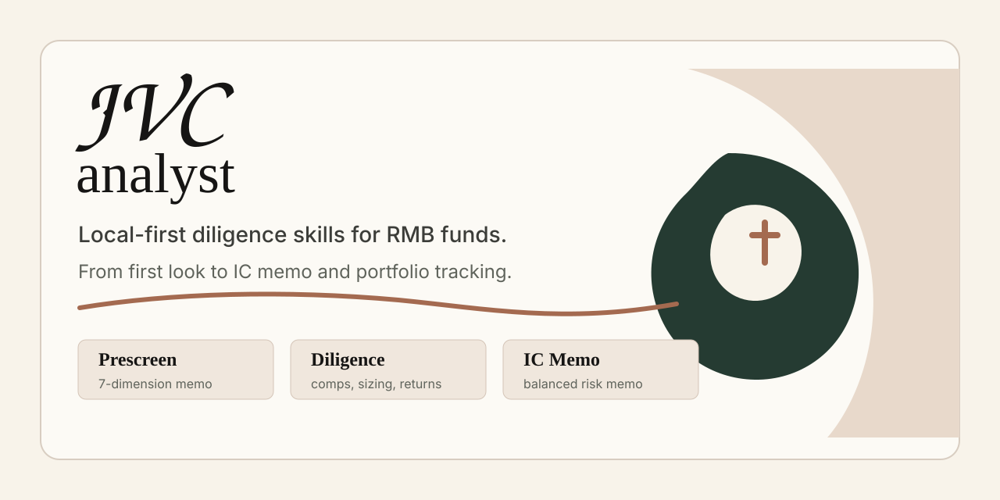

# jvc-analyst

<p align="center">
  
</p>

<p align="center">
  <a href="#安装"></a>
  <a href="#工具总览"></a>
  <a href="#使用原则"></a>
  <a href="LICENSE"></a>
</p>

`jvc-analyst` 是一套给早期股权投资用的 AI 工具箱，以 Agent Skills 的形式运行在 Claude Code、Codex、Cursor 等 AI 助手里，面向中国市场 Pre-seed 到 Series B 的项目。

它把 BP、访谈逐字稿、财务表、尽调报告变成可以直接转给合伙人的初稿：**先给判断，再给依据**；缺数据时给有依据的估算并标注，而不是留白。它不替你做投资决定，所有材料留在本地。

## 工具总览

10 个 skill 覆盖一个项目从第一次看到投后的日常工作，每个都能单独调用。

| 阶段 | Skill | 什么时候用 | 产出 |
| --- | --- | --- | --- |
| 看项目 | `/jvc-prescreen` 初筛 | 第一次看 BP，判断值不值得见创始人 | `01-prescreen.md`：一句话判断、七维度、最可能不成立的理由、见面问题 |
| 访谈 | `/jvc-interview-prep` 访谈提纲 | 见创始人、客户、专家之前 | 按优先级排序的问题，每题标“过关 / 警惕”信号 |
| | `/jvc-meeting-notes` 访谈纪要 | 访谈之后，整理逐字稿或录音转写稿 | Word 纪要（交付版 + 含待验证点的工作版），自带错别字、逻辑、矛盾自查 |
| 分析 | `/jvc-business-economics` 商业经济 | 想知道一单赚多少、做大后变好还是变差、现金能撑多久 | `business-economics.md` + 可重跑的计算脚本 |
| | `/jvc-track-research` 赛道研究 | 新赛道开题、看行业机制、分析竞争格局 | 全景报告 / 行业机制 / 竞争格局，可渲染为 PDF 研报 |
| | `/jvc-workbook` 建模工作簿 | 需要市场规模、可比公司或投资回报的 Excel | Excel 工作簿 + 一页结论 |
| | `/jvc-thesis-test` 投资论点 | 把投资逻辑写成可检验的论点，或专门唱反调 | 支持、反驳、“什么情况下就错了”、命门 |
| 尽调 | `/jvc-dd-report-digest` 尽调报告消化 | 拿到第三方财务、法律、审计尽调报告 | 红旗表、与 BP 口径不一致之处、条款处理建议 |
| 投决 | `/jvc-ic-memo` 投决备忘录 | 上投决会前 | 十七章预审版 `06-ic-memo-review.md`；你明确“预审通过”后才出终版 `06-ic-memo.md` |
| 投后 | `/jvc-portfolio-tracking` 投后跟踪 | 被投公司季报、月报到了 | 季度简报 + 投后仪表板更新内容 |

另有一个独立选装的 `/jvc-invoice-manager`，用于差旅发票 OCR 识别与报销归档，不属于投资研究。

## 安装

```bash
git clone https://github.com/justinjia0813/jvc-analyst.git ~/.agents/sources/jvc-analyst
cd ~/.agents/sources/jvc-analyst
./setup --global                 # 安装 10 个 skill 和 3 个内部组件
./setup --global --operations    # 可选：加装发票工具
```

安装器会把 skill 链接到 `/.agents/skills/`，以及本机已存在的客户端目录：Claude Code、Codex、Cursor、Hermes、OpenClaw、OpenCode、Pi、Grok。装完后重开一次 AI 助手的会话即可使用。

- 源码目录需要保留，各客户端里的 skill 都是指向它的链接。
- 更新：在源码目录执行 `git pull`；只有新增或删除了 skill 时才需要重跑 `./setup --global`。
- 安装器不会删除任何已有的 skill；同名目录会先备份到 `/.local/state/jvc-analyst/backups/`。

## 快速上手

在 AI 助手里用斜杠命令或自然语言调用：

```text
/jvc-prescreen 看下 projects/星澜工控/00-source/BP.pdf，给合伙人一页判断
/jvc-interview-prep 明天见星澜的创始人，60 分钟，重点问订单真实性和现金
/jvc-meeting-notes 把这份管访转写稿和我的随笔整理成六段式纪要
帮我算一下这家公司一条产线交付后到底赚不赚钱，现金能撑多久
```

按问题选最小组合即可，不需要每次跑完整流程。常见组合：

1. **收到 BP**：`/jvc-prescreen` → 值得见就 `/jvc-interview-prep`。
2. **访谈之后**：`/jvc-meeting-notes`，工作版里的待验证点就是下一轮的问题。
3. **新赛道**：`/jvc-track-research`；要数字时接 `/jvc-workbook`。
4. **核对交易**：`/jvc-business-economics` + `/jvc-workbook` 投资回报 + `/jvc-thesis-test`。
5. **上会**：`/jvc-ic-memo` 预审版，确认后出终版。
6. **投后**：每季度 `/jvc-portfolio-tracking`。

一个虚构项目从初筛走到投后的完整串联，见 [端到端示例](examples/end-to-end-walkthrough.md)；每个 skill 的产出样例在 [`examples/`](examples/)。

## 项目档案目录约定

产出默认写进材料所在的项目文件夹；没有项目文件夹时，AI 会先问你放哪。中间文件（计算脚本、转换文本等）统一放在同目录的 `_work/`。

```text
projects/{公司}/
├── 00-source/                  # 原始材料，只读
├── spec/                       # 可选：研究规格
│   ├── CONTEXT.md              #   共享语言与判断标准
│   ├── research-plan.md        #   范围与验收标准
│   ├── hypotheses.md           #   3–5 条可证伪假设
│   └── tasks.md                #   验证任务
├── 01-prescreen.md
├── interview-prep-{对象}.md
├── 【YYYY年MM月DD日访谈】{对象}.docx
├── business-economics.md
├── 04-thesis-test.md
├── 05-market-sizing.xlsx / 05-comps-dd.xlsx / 05-roi-modeler.xlsx
├── dd-digest-{报告类型}.md
├── 06-ic-memo-review.md        # 预审版
├── 06-ic-memo.md               # 终版
├── decision-journal.md         # 你自己的决策记录
└── _work/

tracks/{赛道}/                   # 赛道研究
portfolio/{公司}/                # 投后跟踪
```

## 使用原则

- **材料留在本地**：不要把 BP、逐字稿、财务表上传到第三方网页工具。skill 本身不含任何联网脚本，公开资料的检索由 AI 助手完成。
- **判断在前，依据在后**：正文是结论和关键数字，来源放附录；公司说法标 `[创始人自述]`，推算标 `[估算：依据]`，每份产出写明“最可能错在哪”。
- **不替你决策**：不会写“建议投资 / 不建议投资”。
- **产出是初稿**：数字和来源请复核。目前只有商业经济分析在真实项目材料上做过端到端验证，其余 skill 通过了确定性检查，欢迎通过 Issue 反馈。

## 进阶配置

**自定义 Word 纪要模板**：按优先级依次读取 `--template <路径>`、环境变量 `JVC_DOCX_TEMPLATE`、`skills/jvc-meeting-notes/templates/custom.docx`（已被 git 忽略，适合放机构模板），最后才用内置的中性模板。

**研究分级**：项目越接近投决，需要的工件越多。L0 快筛只要初筛或纪要；L1 加 `spec/CONTEXT.md`、`spec/research-plan.md`、`spec/hypotheses.md`；L2 加 `spec/tasks.md` 和证据；L3（上会前）再加完整证据和 `decision-journal.md`。级别只控制工件多少，不改变上面的使用原则。

**证据内核（可选）**：`jvc-research-core` 维护一条只能追加的证据台账，并对产出做确定性审查。默认不启用；`/jvc-ic-memo` 上会前会以严格模式使用，其他 skill 在你要求 `--rigor` 时启用。

## 开发

```bash
bash scripts/check-review-fixes.sh      # 全部确定性检查，含发布前隐私检查
```

发布前隐私检查 `scripts/check-public-release.py` 会拦截本机路径、个人邮箱、密钥、Office 文件作者信息，以及你放在 `/.config/jvc-analyst/private-names.txt` 里的私有名单（该文件不进仓库）。

## 许可

[MIT](LICENSE)
