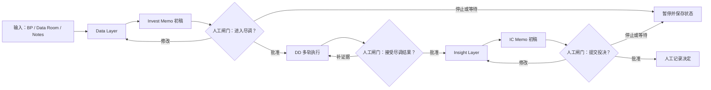

# `jvc-deal-flow` 工作流编排 Skill 规格

- 日期：2026-07-30
- 状态：用户已确认；2026-07-31 按薄编排边界完成首版实现
- 范围：`jvc-analyst` 项目研究编排、项目库维护、项目状态与改动日志
- 设计依据：`/Users/justinjia/Documents/IC Memo Flow.tldraw`、`jvc-analyst` 3.0 目录与研究分级、`jvc-research-core` 证据合同

## 1. 用户可见结果

`jvc-deal-flow` 是一个用户可调用的编排 Skill。它把现有独立 `/jvc-*` Skill 组织成一条可暂停、可恢复、可审计的投前工作流，同时维护本地项目库。

用户只需说明项目、材料、当前阶段和停止点，例如：

```text
按《IC Memo Flow》执行【和光智成】。
资料：/absolute/path/to/访谈.docx
当前阶段：首次建档
先完成 Data Layer 和 Invest Memo 初稿，进入尽调前暂停让我审核。
```

一次成功执行至少产生：

1. 与当前阶段相符的研究工件；
2. 项目在本地项目库中的唯一身份；
3. 可恢复的当前状态和下一步；
4. 追加式改动历史；
5. 研究证据的 `ready`、`partial` 或 `blocked` 状态；
6. 明确的人工审核点，不替用户决定是否进入尽调、是否提交投决或是否投资。

Venture Capital（VC，风险投资，指对未上市成长型企业进行股权投资的活动）研究中的“完成”不是文件存在，而是阶段要求、证据审查、产物校验和人工闸门共同满足。

本文使用：

- Artificial Intelligence（AI，人工智能，指由机器执行信息提取、推理和生成等任务的技术）；
- Research Level 0–3（L0–L3，研究级别 0–3，指按决策场景控制研究流程密度的四级体系）；
- Investment Committee Memo（IC Memo，投资决策委员会备忘录，指提交基金内部投决审议的研究文件）；
- Return on Investment（ROI，投资回报率，指投入资本相对回报的衡量方式）；
- Comparable Companies Analysis（Comps，可比公司分析，指用相似公司的经营和估值指标进行比较）；
- JavaScript Object Notation（JSON，JavaScript 对象表示法，指机器可读的结构化数据格式）；
- JSON Lines（JSONL，逐行 JSON 格式，指每行保存一个独立 JSON 对象的追加式文件）；
- Office Open XML Document（DOCX，Office Open XML 文档，指常见的 Word 文档文件格式）。

## 2. 核心设计判断

### 2.1 固定骨架，不固定所有节点

固定主线为：

```text
输入
→ Data Layer
→ Invest Memo 初稿
→ 尽调前人工审核
→ 尽调执行
→ Insight Layer
→ IC Memo
→ 投决前人工审核
→ 人工记录最终决策
```

Business Plan（BP，商业计划书，指公司向投资人展示业务、团队和融资计划的材料）、访谈、财务资料、客户资料和行业资料可以并行进入 Data Layer。

Due Diligence（DD，尽职调查，指投资前对公司、业务、财务、法律和市场进行系统核验）中的具体轨道按项目缺口选择，不因 Skill 可用就全部启动。固定的是阶段顺序、证据纪律和人工闸门，不是每个项目都跑同样数量的研究。

### 2.2 Data Layer 与 Insight Layer 分离

- **Data Layer** 保存来源、事实、公司自述、用户观察、模型输入和信息缺口，不把候选解释包装成事实。
- **Invest Memo 初稿** 把 Data Layer 转换成尽调前的假设、初始论点和问题清单；它不是正式投决备忘录。
- **Insight Layer** 保存经过尽调支持、反驳或收窄后的行业与公司论点。
- **IC Memo** 只消费可追溯的 Data Layer、Insight Layer、尽调结果和模型结果。

画布中的 `PREFILL` 只表示候选解释：尽调前先放入 `INVEST_MEMO.md` 的假设区，避免提前形成第二份“已验证”论点文件；尽调结果、LDD/FDD、ROI 与 Comps 完成后，再把被支持或收窄的内容写入 `INSIGHT_LAYER.md`。

Investment Committee（IC，投资决策委员会，指基金内部审议投资项目的组织）Memo 与尽调前 Invest Memo 是两个不同工件：

| 工件 | 作用 | 最低研究级别 | 默认文件 |
| --- | --- | --- | --- |
| Invest Memo 初稿 | 形成尽调前的工作假设和验证问题 | L1 | `INVEST_MEMO.md` |
| IC Memo | 汇总已审证据、分歧、风险、条款与待决事项 | L3 | `06-ic-memo.md` |

### 2.3 编排状态、证据状态和投资决定分离

不得用一个模糊的 `status` 同时表示项目暂停、研究不完整和投资结论。项目至少维护五个正交状态轴：

| 状态轴 | 允许值 | 含义 |
| --- | --- | --- |
| `lifecycle_status` | `active`、`paused`、`closed`、`archived` | 项目是否正在推进 |
| `workflow_stage` | 见 §7 | 当前处于哪一个工作流阶段 |
| `research_level` | `L0`、`L1`、`L2`、`L3` | 流程密度和强制工件 |
| `research_status` | `not_audited`、`ready`、`partial`、`blocked` | 当前研究工件的证据质量 |
| `decision_status` | `undecided`、`invest`、`pass`、`wait` | 用户明确给出的投资决定 |

`decision_status` 只能记录用户原话或用户确认的决定；Skill 不得自行填写。

## 3. 角色

`jvc-deal-flow` 负责：

- 识别或初始化项目；
- 读取当前状态并选择最低充分研究级别；
- 按状态机调用现有 `/jvc-*` Skill；
- 建立和更新 Data Layer、Invest Memo、Insight Layer；
- 在人工闸门前暂停，在批准后恢复；
- 注册来源、产物、审核状态和相互依赖；
- 维护项目状态、人类可读的项目库索引和追加式改动日志；
- 在新资料到达时标记受影响工件，提出最小重跑范围。

它不负责：

- 替用户决定建档、升降级、进入尽调、提交 IC 或投资；
- 把每个项目强制跑成 L3；
- 代替律师完成 Legal Due Diligence（LDD，法律尽职调查，指对公司法律主体、合同、知识产权和合规风险的核验）；
- 代替会计师完成 Financial Due Diligence（FDD，财务尽职调查，指对财务报表、收入质量、现金流和税务等事项的核验）；
- 修改 `00-source/` 原始材料；
- 把敏感项目材料发送到外部服务；
- 重复实现 `jvc-research-core` 已有的证据账本和研究审查。

## 4. Skill 触发与输入合同

### 4.1 名称与触发描述

Skill 名称固定为 `jvc-deal-flow`。描述应覆盖以下触发：

- 用户要求按固定流程执行一个项目；
- 首次建档或恢复已有项目；
- 查询、暂停、继续、关闭或归档项目；
- 更新项目状态、研究级别或下一步；
- 加入新资料并判断影响范围；
- 查看项目库或项目改动日志；
- 从 Data Layer 推进到 Invest Memo、尽调、Insight Layer 或 IC Memo。

### 4.2 用户输入

Skill 接受自然语言，并归一化为以下请求：

```json
{
  "action": "initialize | continue | status | update | pause | resume | close | archive | reopen",
  "project_name": "和光智成",
  "library_root": "/absolute/path/to/local-library",
  "source_paths": ["/absolute/path/to/source.docx"],
  "current_stage_hint": "首次建档",
  "target_stage": "pre_dd_review",
  "stop_at": "pre_dd_review",
  "requested_research_level": "L1",
  "user_decision": null,
  "notes": "先完成 Data Layer 和 Invest Memo 初稿"
}
```

只有 `project_name` 和当前动作无法从上下文恢复时才询问。可从本地状态安全恢复的信息不重复询问。

### 4.3 项目库定位

Skill 包与真实项目库必须分离：

- `jvc-analyst` 仓库保存方法、模板、脚本和评测；
- `library_root` 保存真实项目材料和项目状态；
- 不得因为 Skill 安装在 `jvc-analyst`，就把真实被投项目写入公开方法仓库。

定位顺序：

1. 使用用户本次给出的绝对 `library_root`；
2. 否则使用当前工作区已存在的 `.jvc-library.json`；
3. 否则只在当前工作区向上查找一个明确的项目库标记；
4. 仍无法唯一确定时暂停并询问，不跨目录猜测。

第一版项目库标记只保存：

```json
{
  "schema_version": "1.0",
  "projects_dir": "projects"
}
```

不在配置中保存项目状态或敏感材料路径。

## 5. 项目身份与去重

每个项目有一个不可变的 Universally Unique Identifier（UUID，通用唯一标识符，用于在改名和目录调整后保持项目身份稳定）`project_id`，显示名称和目录名可以变化。

初始化前按以下顺序查重：

1. `project_id` 精确匹配；
2. 显示名称或别名精确匹配；
3. 规范化名称匹配；
4. 模糊匹配只用于提示，不自动合并。

唯一匹配时恢复已有项目，不重复建档。出现多个候选时列出候选并暂停。项目改名通过追加 `project_renamed` 事件完成，保留旧名称为别名，不更换 `project_id`，不自动移动目录。

## 6. 项目目录合同

在现有 3.0 目录上增量增加工作流工件，不批量迁移旧项目，不创建当前研究级别不需要的空目录。

```text
<library-root>/
├── .jvc-library.json                 # 项目库标记和 schema 版本
├── PROJECTS.md                       # 自动生成的人类可读项目索引
└── projects/
    └── <company-slug>/
        ├── .jvc/
        │   └── project_events.jsonl  # 项目操作与状态的唯一追加式事件源
        ├── 00-source/                # 只读原始材料
        ├── spec/
        │   ├── CONTEXT.md
        │   ├── research-plan.md
        │   ├── hypotheses.md
        │   └── tasks.md
        ├── STATE.md                  # 由事件源生成的当前状态视图
        ├── CHANGELOG.md              # 由事件源生成的改动历史视图
        ├── DATA_LAYER.md             # 结构化事实层
        ├── INVEST_MEMO.md            # 尽调前工作备忘录
        ├── INSIGHT_LAYER.md          # 经验证的行业/公司论点
        ├── evidence_registry.jsonl   # jvc-research-core 唯一证据事实源
        ├── audit.json
        ├── audit.md
        ├── evidence/
        ├── 01-prescreen.md
        ├── 02-dd-notes.md
        ├── 03-founder-sync.md
        ├── 04-bull-case.md
        ├── 04-bear-case.md
        ├── 05-comps-dd.xlsx
        ├── 05-market-sizing.xlsx
        ├── 05-roi-modeler.xlsx
        ├── 06-ic-memo.md
        ├── decision-journal.md
        └── 99-decision.md
```

来源在项目目录外时默认只登记绝对路径、文件指纹和只读引用，不擅自复制或移动。只有用户明确要求建立独立 Data Room（数据室，指集中存放尽调材料的受控目录）时才复制到 `00-source/`，仍不改动原件。

`STATE.md`、`CHANGELOG.md` 和 `PROJECTS.md` 顶部必须标注“自动生成，请通过 `jvc-deal-flow` 更新”，避免形成多个事实源。

### 6.1 与 3.0 研究级别合同的兼容

现有独立 `/jvc-prescreen` 的 L0 规则不变：直接调用时仍只生成 `01-prescreen.md`。

用户显式调用 `jvc-deal-flow` 即表示选择“受编排项目”模式。该模式为维护项目库，在 L0/L1 也允许增加最小的 `.jvc/project_events.jsonl`、`STATE.md` 和 `CHANGELOG.md`；这些是运行与审计元数据，不算研究工件，不触发 L2 尽调流程。

进入 L2 后，同一份 `STATE.md` 扩展显示多轨尽调节点，不另建第二份状态文件。历史项目默认不迁移；只有用户明确要求接入 `jvc-deal-flow` 时才初始化事件链。

## 7. 工作流状态机

### 7.1 阶段定义

| `workflow_stage` | 用户可见含义 | 进入条件 | 完成锚点 | 下一步 |
| --- | --- | --- | --- | --- |
| `intake` | 首次建档与材料登记 | 用户明确建档或继续已有项目 | 项目身份唯一，来源已登记 | `data_layer` |
| `data_layer` | 提取和整理事实层 | 有可读材料 | `DATA_LAYER.md` 通过结构和来源检查 | `invest_memo` |
| `invest_memo` | 形成尽调前工作假设 | Data Layer 可用 | `INVEST_MEMO.md`、L1 规格工件和审查状态可用 | `pre_dd_review` |
| `pre_dd_review` | 尽调前人工审核 | Invest Memo 已生成 | 用户明确 `approve`、`revise` 或 `stop` | `diligence` 或返回修改 |
| `diligence` | 多轨尽调执行 | 用户批准且项目升级到 L2+ | 所选尽调轨道均有真实产物、缺口或阻塞原因 | `post_dd_review` |
| `post_dd_review` | 尽调结果人工复核 | 尽调轨道已收敛 | 用户确认哪些发现进入论点层 | `insight_layer` |
| `insight_layer` | 收敛行业与公司论点 | 尽调结果已复核 | `INSIGHT_LAYER.md` 中每条论点有支持、反驳、边界和状态 | `ic_memo` 或继续尽调 |
| `ic_memo` | 形成正式 IC Memo 初稿 | 用户确认进入 L3 | `06-ic-memo.md` 通过 `jvc-ic-memo` 审查 | `ic_review` |
| `ic_review` | 投决前人工审核 | IC Memo 可用 | 用户提出修改、提交投决或停止 | `decision_record` 或返回修改 |
| `decision_record` | 记录用户决定 | 用户明确给出决定 | `decision-journal.md` 或 `99-decision.md` 有人工决定 | 保持、关闭或监控 |

`paused`、`closed` 和 `archived` 属于 `lifecycle_status`，不是新的 `workflow_stage`。暂停后恢复到原阶段。

### 7.2 主图



### 7.3 Data Layer 结构

`DATA_LAYER.md` 至少包含：

1. 来源清单与版本；
2. 公司、成立、融资阶段与 Capitalization Table（Cap Table，股权结构表，指股东、持股比例和历次融资变化）；
3. 产品、技术与交付形态；
4. 财务、收入质量、成本和现金；
5. 客户、使用、采购与复购；
6. 供应商、产业链与依赖；
7. 团队、管理层与关键岗位；
8. 会议、行业人士和专家信息；
9. 支撑数据、口径、冲突和缺失；
10. 事实类型：第三方事实、公司自述、用户观察、模型估算、代理推断或未知。

Data Layer 不回答“是否值得投”，也不把 Insight Layer 的护城河、飞轮和行业展望写成已验证事实。

### 7.4 Invest Memo 结构

`INVEST_MEMO.md` 是尽调前工作文件，至少包含：

1. 一页事实摘要；
2. 为什么现在值得继续验证；
3. 初步行业与公司论点；
4. 初步 Bull / Bear；
5. 3–5 条可证伪核心假设；
6. 每条假设的支持、反驳、未知和证伪条件；
7. 建议的尽调轨道、优先级和完成标准；
8. 明确不覆盖的范围；
9. 尽调前需要用户确认的事项。

它必须显式写明“尽调前初稿，不是 IC Memo，不含投资建议”。

### 7.5 尽调轨道

进入 `diligence` 后，根据假设缺口选择最小充分轨道：

| 轨道 | 典型输入 | 路由 |
| --- | --- | --- |
| 行业与产业链 | 行业边界、驱动、瓶颈、供应链 | `jvc-track-research` |
| 竞品与可比公司 | 直接竞品、替代方案、海外标杆 | `jvc-comps-dd` |
| 市场空间 | 地域、客群、场景、价格与数量 | `jvc-market-sizing` |
| 客户/专家/管理层访谈 | 逐字稿和用户笔记 | `jvc-meeting-notes` 或 `jvc-talk-notes` |
| 正反论证 | 已审事实、访谈和模型 | `jvc-bull-case` 与 `jvc-bear-case` |
| 回报与条款 | 投资条款、稀释和退出假设 | `jvc-roi-modeler` |
| 法律尽调 | 律师报告、合同和合规清单 | 只登记外部 LDD 结果，不冒充完成 |
| 财务尽调 | 财务底稿、审计和收入核验 | 只登记外部 FDD 结果，不冒充完成 |

ROI 与 Comps 只在相关输入和研究级别满足时运行。

### 7.6 Insight Layer 结构

`INSIGHT_LAYER.md` 对齐画布中的两组问题：

| 论点组 | 必答问题 |
| --- | --- |
| 行业论点 | Outlook（展望）、Drivers（驱动因素）、Bottlenecks（瓶颈）、Sustainability（可持续性） |
| 公司论点 | Moat（护城河）、Flywheel（飞轮）、产品、团队、经济性 |

每条论点必须包含：

- 当前陈述；
- 支持 Claim；
- 反驳 Claim；
- 适用边界；
- 置信度和证据状态；
- 什么新证据会推翻它；
- 受影响的 Invest Memo 或 IC Memo 段落。

## 8. 人工闸门与停止规则

### 8.1 强制人工闸门

以下动作不得自动跨越：

1. L0 → L1、L1 → L2、L2 → L3 的研究级别升级；
2. `pre_dd_review` 后进入尽调；
3. 把 AI 候选 Claim 标记为人工验证；
4. 批准 `jvc-research-core` waiver；
5. `post_dd_review` 后接受哪些发现进入 Insight Layer；
6. 提交 IC；
7. 写入 `decision_status`；
8. 关闭或归档项目。

用户在同一条指令中明确授权某个动作时，不重复询问。

### 8.2 必须暂停

出现以下情况时保存状态并暂停：

- 项目身份存在多个候选；
- 用户指定的阶段与本地状态冲突；
- 新资料推翻已有核心假设，需要用户选择重开范围；
- 需要进入更高研究级别但用户未授权；
- 研究内核、profile、账本或项目事件链损坏；
- 证据状态为 `blocked` 且继续写作会形成受影响判断；
- 下一步需要法律、财务或第三方协调，当前没有对应结果；
- 用户设定的 `stop_at` 已到达。

### 8.3 不阻塞但必须降级

关键资料不足但仍能形成收窄后的可靠输出时：

- 将 `research_status` 设为 `partial`；
- 在标题、摘要和下一步中显式标注不完整；
- 不把 `partial` 写成阶段全部完成；
- 保留可继续恢复的下一步。

## 9. 项目事件与改动日志合同

### 9.1 唯一事件源

`<project-dir>/.jvc/project_events.jsonl` 是项目身份、工作流状态、来源注册、产物变化和人工闸门的唯一操作历史。

JSONL 适合本地增量记录和恢复。不得直接手工编辑、删除、插入或重排历史事件；所有写入通过确定性脚本完成。

证据内容不复制到项目事件日志：

- `evidence_registry.jsonl` 负责“研究主张为什么成立”；
- `project_events.jsonl` 负责“项目何时发生了什么变化”；
- `decision-journal.md` 负责“人当时决定了什么、为什么”。

### 9.2 事件公共字段

每个事件至少包含：

```json
{
  "schema_version": "1.0",
  "event_id": "evt_...",
  "sequence": 12,
  "occurred_at": "2026-07-30T18:00:00+08:00",
  "actor": "user | codex | external",
  "project_id": "uuid",
  "event_type": "workflow_transitioned",
  "run_id": "run_...",
  "trigger": "用户指令摘要",
  "reason": "为什么发生此变化",
  "from": {},
  "to": {},
  "input_refs": [],
  "output_refs": [],
  "producer": "jvc-deal-flow",
  "approval_ref": null,
  "supersedes": null,
  "previous_event_hash": "sha256:...",
  "event_hash": "sha256:..."
}
```

Secure Hash Algorithm 256-bit（SHA-256，256 位安全哈希算法，用于判断文件或事件内容是否变化）只用于完整性和去重，不代表内容真实。

### 9.3 事件类型

至少支持：

- `project_initialized`
- `project_renamed`
- `source_registered`
- `source_superseded`
- `artifact_created`
- `artifact_updated`
- `artifact_marked_stale`
- `artifact_audited`
- `workflow_transitioned`
- `research_level_changed`
- `lifecycle_changed`
- `gate_requested`
- `gate_decided`
- `decision_recorded`
- `error_recorded`
- `project_reconciled`

不记录模型隐藏推理、密钥、完整 prompt、每次文件读取或无业务意义的工具调用。

### 9.4 更正而非改写

- 来源修正追加 `source_superseded`，指向旧事件和对应证据记录；
- 产物更新保存旧、新文件指纹和影响摘要；
- 状态更正追加新事件，不修改历史行；
- 误录事件不能删除，追加 `project_reconciled` 说明修正；
- `CHANGELOG.md` 从有效事件链重新生成。

### 9.5 人类可读改动日志

`CHANGELOG.md` 按时间倒序显示：

| 时间 | 类型 | 变化 | 原因 | 影响工件 | 操作者 |
| --- | --- | --- | --- | --- | --- |

只呈现有业务意义的变化。每条记录可回链 `event_id`、来源或产物路径。

## 10. 项目状态与项目库视图

### 10.1 `STATE.md`

`STATE.md` 至少显示：

- 项目名称、别名和 `project_id`；
- 五个状态轴；
- 当前人工闸门；
- 当前阻塞和等待外部事项；
- 已完成、进行中、待执行和已标记陈旧的工件；
- 最近一次有效审查；
- 最近一次用户批准；
- 下一步最小动作；
- 最近更新时间和最后事件编号。

状态只能由事件链派生，不能由代理自述“完成”直接翻转。

### 10.2 `PROJECTS.md`

项目库索引从各项目事件链扫描生成，不维护第二份手工数据库：

| 项目 | 生命周期 | 阶段 | 研究级别 | 研究状态 | 当前闸门/阻塞 | 下一步 | 最近更新 |
| --- | --- | --- | --- | --- | --- | --- | --- |

默认视图优先显示：

1. 等待用户审核；
2. 被阻塞；
3. 活跃推进；
4. 已暂停；
5. 已关闭或归档。

归档是状态变化，不删除项目目录或历史。

## 11. 新资料、依赖与最小重跑

每个产物登记：

- 相对路径；
- 文件指纹；
- 产生它的 Skill；
- 输入来源和 Claim 引用；
- 研究审查状态；
- 创建时间和最近更新时间。

新资料到达后：

1. 按路径和内容指纹去重；
2. 通过 `jvc-research-core` 登记新证据或更正；
3. 找到直接依赖该来源或 Claim 的产物；
4. 追加 `artifact_marked_stale`；
5. 输出受影响范围和最小重跑建议；
6. 用户批准后只重跑受影响节点；
7. 生成 Memo diff，说明哪些判断变化、为什么。

“文件被修改”不等于“事实被推翻”。Skill 必须区分格式变化、补充信息、事实更正和核心假设变化。

## 12. 与现有 JVC Skill 的编排关系

| 阶段 | 必选/条件选 | Skill 或模块 | 约束 |
| --- | --- | --- | --- |
| Intake | 必选 | `jvc-deal-flow` | 查重、登记项目和来源 |
| Data Layer | 必选 | `jvc-deal-flow` + `jvc-prescreen` | L0 可只做 prescreen；L1 建立规格和证据链 |
| 访谈事实层 | 条件选 | `jvc-meeting-notes` / `jvc-talk-notes` | 原话与解读分离 |
| Invest Memo | 必选 | `jvc-deal-flow` | 新的早期工作备忘录，不调用 L3 `jvc-ic-memo` 冒充 |
| 尽调 | 条件选 | `jvc-track-research`、`jvc-comps-dd`、`jvc-market-sizing`、`jvc-roi-modeler` | 按假设缺口选择 |
| 正反论证 | L2+ 必选 | `jvc-bull-case`、`jvc-bear-case` | 可并行，保留冲突 |
| Insight Layer | 必选 | `jvc-deal-flow` | 只收敛已登记 Claim |
| IC Memo | L3 必选 | `jvc-ic-memo` | 只消费有效上游审查 |
| 报告排版 | 条件选 | `jvc-research-report` | 只排版已完成研究 |
| 知识树 | 条件选 | `jvc-knowledge-tree-builder` | 只在已有资料需要结构化视图时运行 |
| 发票 | 排除 | `jvc-invoice-manager` | 不进入投资研究链 |

各业务 Skill 继续拥有自己的专业产物。`jvc-deal-flow` 只拥有编排、状态、事件、Data Layer、Invest Memo 和 Insight Layer，不复制业务 Skill 的研究方法。

`jvc-research-core` 增加 `profiles/jvc-deal-flow.json`，只审查编排 Skill 自己产生的 Markdown 工件及其来源回链：

- 尽调前审查同时传入 `DATA_LAYER.md` 和 `INVEST_MEMO.md`；
- 尽调后审查再传入 `INSIGHT_LAYER.md`；
- 行业研究、模型、Bull/Bear 和 IC Memo 继续使用各自业务 Skill 的 profile；
- 反向检索、独立来源和模型口径等专业规则由上游业务 Skill 审查，编排 profile 不重复实现。

## 13. 确定性运行模块

关键状态写入不能只靠 prompt 约束。实现新增一个最小的本地标准库状态脚本；接口、生命周期元数据和自检只服务安装与治理，不增加运行时业务层：

```text
skills/jvc-deal-flow/
├── SKILL.md
├── agents/
│   └── interface.yaml
├── manifest.json
├── scripts/
│   ├── dealflowctl.py
│   └── check_package.py
└── references/
    ├── workflow-contract.md
    └── project-event-contract.md

skills/jvc-research-core/profiles/
└── jvc-deal-flow.json
```

不新增 README、数据库、消息队列或网络服务。Skill 创建和治理优先使用项目约定的 `/yao-meta-skill`。`check_package.py` 只在临时项目库运行验收，不属于用户工作流命令。

Command-Line Interface（CLI，命令行界面，指通过终端参数调用程序的接口）只保留四个命令：

```bash
python3 dealflowctl.py init --library-root <path> --project-name <name>
python3 dealflowctl.py event --project-dir <path> --input <event.json>
python3 dealflowctl.py check --project-dir <path>
python3 dealflowctl.py list --library-root <path>
```

模块内部负责：

- 项目查重和不可变 `project_id`；
- 事件 schema 和状态转换校验；
- 单写者锁；
- 事件哈希链和原子追加；
- 从事件链重建 `STATE.md`、`CHANGELOG.md` 和 `PROJECTS.md`；
- 来源和产物指纹；
- 幂等事件；
- 中断后的恢复。

调用方不得直接写 `project_events.jsonl` 或手工翻转状态。

## 14. LangGraph 适配合同

Skill 本身与运行时解耦：在普通 Codex 对话中可以直接执行。首版不实现 LangGraph 适配器；只有出现稳定的跨会话自动调度需求时再单独增加。

LangGraph（用于构建有状态代理工作流的图式运行框架）只负责调度，不成为项目库事实源：

- 一个 `project_id` 对应一个 `thread_id`；
- checkpoint 保存短期运行位置和节点输入；
- 项目事件链保存跨运行时、跨会话的业务状态；
- Graph State 只保存路径、标识符和摘要，不复制完整项目材料；
- 每个有副作用节点必须以 `event_id` 幂等；
- 人工闸门使用 `interrupt()` 暂停，用户批准后用恢复命令继续；
- 节点重启时先读取项目事件链，再判断是否需要执行；
- LangGraph checkpoint 丢失时，仍可从项目库恢复；
- 项目事件链损坏时，不得只靠 checkpoint 继续。

Directed Acyclic Graph（DAG，有向无环图，指节点按依赖关系连接且不形成循环的任务图）可用于尽调轨道并行；重新补证据属于新的事件和下一轮执行，不在同一轮中无限循环。

建议节点：

```text
restore_or_init
→ register_sources
→ build_data_layer
→ draft_invest_memo
→ pre_dd_interrupt
→ plan_diligence
→ execute_selected_dd_tracks
→ post_dd_interrupt
→ build_insight_layer
→ draft_ic_memo
→ ic_interrupt
→ record_human_decision
```

## 15. 幂等、并发与故障恢复

- 同一 `event_id` 重放不得产生第二条事件；
- 同一内容指纹的来源重复登记时返回已有引用；
- 事件链写入使用项目级单写者锁；跨项目名称唯一性和 `PROJECTS.md` 写入再使用项目库级单写者锁，已有写者时失败关闭；
- 先校验完整事件，再追加，不允许半条事件；
- 事件追加成功后再原子替换派生视图；
- 若事件已追加但视图生成中断，下次 `check` 从事件链重建；
- 业务产物写入先生成临时文件并校验，再替换目标；
- 产物生成失败不覆盖上一版成功产物；
- 外部手工修改产物时，`check` 只报告指纹漂移；只有明确执行 `project_reconciled` 才写入历史；
- 并行尽调轨道不得并行写同一个产物文件。

## 16. 权限与保密

- `00-source/` 永远只读；
- 默认不复制、移动、改名或删除用户原始材料；
- 外部检索只能发送公开研究问题，不发送 BP、逐字稿、财务表或创始人沟通内容；
- 外部写入、归档移动、删除、公开发布和发送消息仍需用户明确授权；
- 事件日志不得保存密钥、支付信息或完整敏感原文；
- 发票和报销数据不进入项目研究状态或证据链。

## 17. 用户交互格式

### 17.1 开始或继续时

先用 2–3 句话报告：

1. 找到的是新项目还是已有项目；
2. 当前阶段、研究级别和现有工件；
3. 本轮将执行到哪里并在哪个闸门暂停。

### 17.2 阶段完成时

只报告：

- 已生成或更新的工件；
- 研究状态和主要缺口；
- 当前项目状态；
- 本轮新增改动事件；
- 下一步需要用户决定的单一问题。

### 17.3 查询项目库时

默认返回紧凑表格，并优先展示待审核、阻塞和最近变化；不重新运行研究。

## 18. 验收案例

### 18.1 首次建档并停在尽调前

输入：

```text
按《IC Memo Flow》执行【和光智成】。
资料：/Users/justinjia/Desktop/【2026年07月29日访谈】和光智成.docx
当前阶段：首次建档
先完成 Data Layer 和 Invest Memo 初稿，进入尽调前暂停让我审核。
```

必须满足：

1. 新建或唯一恢复“和光智成”，不产生重复项目；
2. 原始 DOCX 不修改、不移动；
3. 形成 `DATA_LAYER.md`、`INVEST_MEMO.md` 和 L1 必需规格工件；
4. 初始化或恢复 `jvc-research-core`，按实际审查结果写 `research_status`；
5. 生成 `STATE.md`、`CHANGELOG.md` 并更新 `PROJECTS.md`；
6. `workflow_stage = pre_dd_review`；
7. `lifecycle_status = paused`；
8. `current_gate = pre_dd_review`；
9. 不启动 LDD、FDD、Comps、ROI、Bull/Bear 或 IC Memo；
10. 最后只询问用户是否修改、停止或批准进入尽调。

### 18.2 重复执行

对同一项目、同一来源、同一停止点再次执行：

- 不重复建档；
- 不重复登记来源；
- 不重复生成相同业务事件；
- 返回当前闸门和已有产物；
- 只有输入、模板、证据或用户要求变化时才更新产物。

### 18.3 新证据推翻旧假设

加入一份客户访谈，直接反驳 `H2`：

- 新证据进入 `evidence_registry.jsonl`；
- 旧 Claim 通过 `supersedes` 保留历史；
- 依赖 `H2` 的 Invest Memo、Insight Layer 或 IC Memo 被标记为 `stale`；
- `CHANGELOG.md` 说明变化原因和受影响工件；
- 不自动重写全部项目；
- 用户批准后执行最小重跑并输出 Memo diff。

### 18.4 项目库状态查询

用户说“列出所有等待我审核的项目”时：

- 只扫描项目事件链并生成状态视图；
- 不调用研究 Skill；
- 返回处于人工闸门、阻塞或 `partial` 的项目；
- 不改变任何项目状态。

### 18.5 最终决定

用户没有明确说“投 / 不投 / 等”时：

- `decision_status` 保持 `undecided`；
- 不生成带终局判断的 `99-decision.md`；
- 不把 IC Memo 的分析语言推断成用户决定。

## 19. 发布前验证

实现完成前至少通过：

1. Skill 触发、安装和治理检查；
2. `dealflowctl.py` 自检：初始化、去重、合法/非法转换、暂停恢复、事件链损坏、视图重建；
3. `jvc-research-core` 兼容检查；
4. 现有全部 `/jvc-*` 契约和产物检查；
5. “和光智成”尽调前暂停案例；
6. 重复执行幂等案例；
7. 新证据导致局部失效和最小重跑案例；
8. 历史项目无事件链时的非破坏性接入案例；
9. `git diff --check`；
10. 实际读取用户会消费的 `STATE.md`、`CHANGELOG.md`、`PROJECTS.md` 和研究工件，不能只验证文件存在。

## 20. 非目标与已确认简化

- 不在第一版引入 SQLite、图数据库、消息队列或常驻服务；
- 不自动生成所有可能的尽调分支；
- 不把 LangGraph checkpoint 当项目库；
- 不把项目改动日志与研究证据账本合并；
- 不建立第二份手工维护的全局项目数据库；
- 第一版改动日志保存语义变化、输入输出引用和前后指纹，不额外保存每版业务产物副本；需要逐字恢复历史版本时再接入 Git 或版本快照；
- 不自动搬迁历史项目；
- 不替代外部 LDD/FDD；
- 不替用户做最终投资判断；
- 不修改现有独立 `/jvc-*` Skill 的专业产物所有权。

第一版只需要一个编排 Skill、一个标准库状态脚本、一个临时目录自检和两份按需加载的合同引用。新资料影响范围只消费显式 `depends_on`、来源和 Claim 引用，不做语义推断式全图重跑。只有出现跨机器同步、上千项目扫描或多人并发写入的真实瓶颈时，再评估数据库或远程服务。
