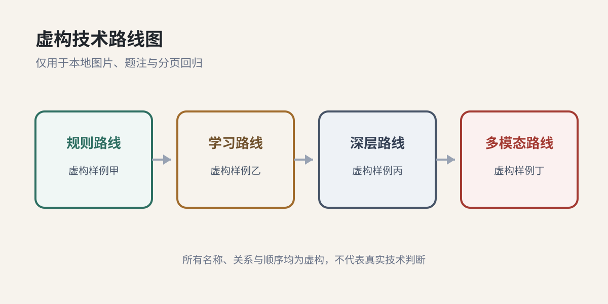

## 研究设定与一页快照

本报告全部正文、表格、图示和来源均为虚构或假设，仅用于测试组装与版式；任何文字都不应被理解为真实行业事实。

本虚构示例假设研究对象为"示例工业视觉质检"，时间、地域、产业边界和判断均仅为组装占位，不描述真实市场。[S1]

> [!FACT]
> 虚构事实卡：样例研究口径聚焦制造业缺陷检测，不纳入通用安防视觉、医疗影像和自动驾驶视觉。[S1]

> [!INFERENCE]
> 虚构推断卡：若客户已从演示转向投资回报率、稳定交付和复用率验证，则行业可能进入商业化早期；这是版式用条件推断，不是现实判断。[S2][推测]

> [!OPEN QUESTION]
> 虚构开放问题：低代码平台能否在复杂缺陷场景里减少专家调参，而不是把成本转移到服务团队？该问题只用于检查未知卡的颜色、间距和分页。[S3]

### 虚构快照

- 假设需求：样例买方仅在虚构预算池甲中比较方案。[S1]
- 假设供给：样例供应方仅包含虚构公司甲、乙、丙。[S2]
- 默认假设：中国市场、早期创业投资、未来 3-5 年。[用户关注点]
- 假设边界：本页不提供任何真实市场规模、增长率或竞争结论。[S3]

## 行业定义与边界

本节虚构地把研究边界限定为样例图像采集、样例缺陷判断和样例人工复核；这些分类只为测试正文层级，不代表真实产业定义。[S1]

表：虚构研究边界，仅用于版式回归

| 虚构边界项 | 样例纳入内容 | 样例排除内容 |
| --- | --- | --- |
| 任务 | 虚构表面检查 | 真实质量管理流程 |
| 买方 | 虚构工厂甲 | 任何现实企业 |
| 地域 | 虚构区域 | 任何现实国家或地区 |

*来源：虚构样例来源一，仅用于版式回归。[S1]*

## 行业简史与产业生命周期

本节虚构的阶段划分仅用于版式回归；阶段名称、顺序与切换条件均为假设，不对应真实历史。[S2]

表：虚构产业生命周期阶段，仅用于版式回归

| 阶段 | 时间 | 关键变化 | 来源 |
| --- | --- | --- | --- |
| 萌芽期 | 2010 前后 | 传统机器视觉设备进入部分高标准产线 | [S1] |
| 试点期 | 2015-2020 | 深度学习开始进入缺陷检测 | [S3] |
| 商业化早期 | 2020-2025 | 工业 AI 创业公司增多 | [S2] |
| 当前阶段 | 2026 | 客户从 demo 转向 ROI 和稳定交付 | [推测] |

*来源：虚构样例来源二与来源三，仅用于版式回归。[S2][S3]*

## 技术路线与商业可行性

下表所有路线、成熟度、成本、场景和限制均为虚构标签，仅用于验证高密度表格的自动换行、表头重复和页面边界。[S2]

表：虚构技术路线比较，仅用于版式回归

| 虚构路线 | 样例机制 | 样例成熟度 | 样例成本条件 | 样例适用场景 | 样例关键限制 |
| --- | --- | --- | --- | --- | --- |
| 传统规则视觉 | 基于规则、阈值、特征工程 | 高 | 固定成本低、变更成本高 | 场景迁移弱 | 规则维护频繁 |
| 深度学习视觉 | 基于监督学习识别缺陷 | 中 | 标注成本中等 | 泛化更强 | 依赖样本和标注 |
| 低代码训练平台 | 把数据采集、标注、训练、部署流程产品化 | 低-中 | 训练成本较高 | 降低部署门槛 | 复杂缺陷能力待验证 |

*来源：虚构样例来源一、三与四，仅用于版式回归。[S1][S3][S4]*

本表不表达任何真实技术优劣、成本水平或商业可行性结论。

## 产业链图谱

下图中的环节及其关系全部为虚构，仅用于验证本地矢量图嵌入、图注和来源行是否与图片保持相邻。[S1]

*来源：虚构样例来源一，仅用于版式回归。[S1]*

表：虚构产业链环节，仅用于版式回归

| 环节 | 价值活动 | 关键玩家 | 核心壁垒 | 来源 |
| --- | --- | --- | --- | --- |
| 上游 | 相机、镜头、光源、工控机 | 海外硬件龙头、国产硬件厂商 | 品控、渠道、稳定性 | [S1] |
| 中游 | 算法平台、检测设备、产线部署 | 传统视觉厂商、AI 创业公司 | 场景理解、算法、交付 | [推测] |
| 下游 | 3C、汽车零部件、注塑、金属件工厂 | 制造企业 | 预算和验收标准 | [S5][未核实] |

*来源：虚构样例来源一与五，仅用于版式回归。[S1][S5]*

图中的环节名称不指向任何真实产品、企业、品牌或市场分类。

## 产业趋势、景气度与周期位置

本节不提供真实趋势。为测试段落密度，仅假设"样例需求信号甲""样例供给信号乙"和"样例预算信号丙"处于不同状态；这些状态没有现实数据支持。[S3]

表：虚构趋势信号，仅用于版式回归

| 虚构信号 | 样例状态 | 样例解释 | 样例反证条件 |
| --- | --- | --- | --- |
| 需求信号甲 | 假设上行 | 仅测试绿色词组的普通文本呈现 | 若虚构记录甲缺失则撤销 |
| 供给信号乙 | 假设平稳 | 仅测试长单元格自动换行 | 若虚构记录乙冲突则撤销 |
| 预算信号丙 | 假设分化 | 仅测试表格行高一致性 | 若虚构记录丙无效则撤销 |

*来源：虚构样例来源三，仅用于版式回归。[S3]*

### 市场规模模型（继承自 market-sizing.csv）

下表数值原样继承自虚构 `market-sizing.csv` 的输入行；汇总行由模型公式计算，不在本报告重述数值。[S1]

表：虚构市场规模输入，数值继承自 market-sizing.csv

| 模型变量 | 保守 | 基准 | 乐观 | 单位 | 来源 |
| --- | --- | --- | --- | --- | --- |
| 上位市场规模（TD_MARKET） | 80000000000 | 100000000000 | 120000000000 | CNY | [S1] |
| 细分赛道占比（TD_SHARE） | 0.08 | 0.10 | 0.12 | ratio | [S2] |
| 目标客户数（BU_CUSTOMERS） | 40000 | 50000 | 60000 | 客户 | [S1] |
| 单客户年支出（A_PRICE） | 80000 | 100000 | 120000 | CNY/客户/年 | [S2] |
| 客户渗透率（BU_PENETRATION） | 0.04 | 0.05 | 0.06 | ratio | [S2] |

*来源：虚构市场模型与示例行业报告，仅用于版式回归。[S1][S2]*

## 关键玩家

所有玩家名称、分层和数字均为虚构，仅用于测试列表与加粗文本，不对应真实公司。[S1]

表：虚构玩家分层，数值继承自 Comps/DD 示例

| 公司 | 国家/地区 | 分层 | 最近一年收入 | 同比增长 | 估值或市值 | 来源 |
| --- | --- | --- | --- | --- | --- | --- |
| 星尘工坊 | 中国 | 目标项目 | 420 万元 | 未核实 | 未披露 | [S4] |
| 传统视觉 A | 中国 | 可比公司 | 3.2 亿元 | 8% | 18 亿元 | [S3] |
| 海外视觉 B | 美国 | 海外标杆 | 12 亿美元 | 4% | 40 亿美元 | [S6][未核实] |

*来源：虚构样例来源三、四与六，仅用于版式回归。[S3][S4][S6]*

- **虚构玩家甲**：假设提供样例采集模块；描述仅为版式占位。
- **虚构玩家乙**：假设提供样例判断模块；描述仅为版式占位。
- **虚构玩家丙**：假设提供样例复核模块；描述仅为版式占位。

## 监管 / 政策 / 标准

本节不引用任何真实法规、政策或标准。[S7]

表：虚构监管与标准，仅用于版式回归

| 类型 | 内容 | 影响 | 来源 |
| --- | --- | --- | --- |
| 政策 | 智能制造相关政策鼓励自动化升级 | 提供方向性支持，但不等于客户预算 | [S7][未核实] |
| 标准 | 缺陷检测验收标准通常由客户和行业决定 | 项目交付需要适配客户标准 | [推测] |
| 监管风险 | 低 | 不涉及强监管审批 | [推测] |

*来源：虚构样例来源七，仅用于版式回归。[S7]*

> [!OPEN QUESTION]
> 虚构合规问题：假设样例系统进入虚构高风险工位时，应补充哪一份虚构验证记录？该问题没有现实法律含义。[S7]

## 投资相关问题与反证账本

以下问题、证据和反证条件均为虚构，不构成投资建议，也不评价任何现实项目。[S3]

表：虚构投资问题与反证，仅用于版式回归

| 假设 | 当前证据 | 机制 | 关键反证 | 继承主张 |
| --- | --- | --- | --- | --- |
| 低代码能降低交付成本 | [S4][推测] | 标注、训练和部署标准化后减少算法工程师工时 | 项目增加后人均交付工时不降 | C12 |
| 数据闭环形成防守性 | [S3][推测] | 更多真实缺陷数据提升模型与工艺适配 | 客户能导出数据并低成本切换供应商 | C18 |
| 市场可以跨场景复制 | [S1][推测] | 共用硬件和训练平台摊薄研发与售后成本 | 每个行业都需重做光学、数据和验收 | C21-C25 |

*来源：虚构样例来源一、三与四，仅用于版式回归。[S1][S3][S4]*

## 后续工作交接包

下列交接项均为虚构任务，只用于验证清单和强调样式。[S3]

- [ ] 虚构任务甲：用 `/jvc-comps-dd` 对比传统视觉厂商、工业 AI 创业公司和自动化集成商；完成标准为占位字段齐全。
- [ ] 虚构任务乙：用 `/jvc-bull-case` 与 `/jvc-bear-case` 整理正反假设；完成标准为占位引用可追踪。
- [ ] 虚构任务丙：用 `/jvc-market-sizing` 按场景拆变量；完成标准为占位结论可撤销。

交接包不要求任何现实调查、联系或外部行动。

## 未核实与待补证据

本次组装已消费 Track Research、Knowledge Tree、Market Sizing 与 Comps/DD 四类输入；无缺失的可选输入。以下为上游已标注的未核实项，逐项列出需要补的证据，不在本报告新增事实或数字。[S6]

表：上游未核实项与待补证据清单，仅用于版式回归

| 说法/数字 | 当前来源 | 需要补的证据 |
| --- | --- | --- |
| 低代码视觉正在成为趋势 | [S4] | 第三方报告、客户采用率、竞品产品路线 |
| 海外视觉龙头收入 | [S6] | 年报原文和分部收入 |
| ROI 验收成为主流 | [S5] | 客户采购访谈、招标文件、复购数据 |

*来源：虚构样例来源四、五与六，仅用于版式回归。[S4][S5][S6]*

## 来源索引

表：虚构来源索引，仅用于版式回归

| 编号 | 标题 | 机构或作者 | 日期 | 链接 | 来源类型 | 可信度 |
| --- | --- | --- | --- | --- | --- | --- |
| S1 | 虚构样例行业综述 | 虚构研究室甲 | 2026-07-01（虚构） | https://example.invalid/fictional-source-1 | 行业报告 | 中，需补一手数据 |
| S2 | 虚构样例融资新闻 | 虚构研究室乙 | 2026-07-02（虚构） | https://example.invalid/fictional-source-2 | 融资新闻 | 低，只能作为线索 |
| S3 | 虚构样例技术文章 | 虚构研究室丙 | 2026-07-03（虚构） | https://example.invalid/fictional-source-3 | 技术文章 | 中，需补产品文档 |
| S4 | 虚构样例公司材料 | 虚构样例公司 | 2026-07-04（虚构） | https://example.invalid/fictional-source-4 | 公司自述 | 低，未独立验证 |
| S5 | 虚构样例客户访谈 | 虚构研究室甲 | 2026-07-05（虚构） | https://example.invalid/fictional-source-5 | 访谈 | 中，需扩大样本 |
| S6 | 虚构样例年报 | 虚构研究室乙 | 2026-07-06（虚构） | https://example.invalid/fictional-source-6 | 年报 | 高，需核验原文 |
| S7 | 虚构样例政策 | 虚构研究室丙 | 2026-07-07（虚构） | https://example.invalid/fictional-source-7 | 政策 | 高，需核验原文 |

*来源：虚构样例来源索引，仅用于版式回归。*
