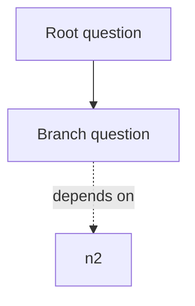

# Output Contract

This skill produces a tree-first, graph-aware knowledge package from local source files.

## Required Files

### `knowledge_tree.md`

Human-readable recursive question tree:

```markdown
# <Topic> Knowledge Tree

## Source Coverage
- Read: <count> files
- Partial or unreadable: <count> files
- Main source roots: <paths>

## 0. Root Question
Question: ...
Current answer: ...
Evidence: [S1], [S2]
Open question: ...

## 1. <First-level branch>
Question: ...
Summary: ...
Evidence: ...
Children:
- 1.1 ...
Related:
- See also: ...
```

### `knowledge_graph.mmd`

Mermaid graph:



Use solid arrows for parent-child tree structure and dotted arrows for cross-links.

### `nodes.json`

Structured data for future UI use:

```json
{
  "topic": "string",
  "generated_at": "ISO-8601",
  "source_manifest": "source_manifest.json",
  "nodes": [
    {
      "id": "stable-kebab-id",
      "title": "string",
      "question": "string",
      "summary": "string",
      "parent_id": "root-or-null",
      "children_ids": ["id"],
      "related_ids": ["id"],
      "evidence_refs": ["S1"],
      "open_questions": ["string"],
      "confidence": "high|medium|low|unknown",
      "status": "source-backed|inferred|needs-evidence"
    }
  ],
  "edges": [
    {
      "from": "id",
      "to": "id",
      "type": "parent|related|depends_on|contrasts_with",
      "label": "string",
      "evidence_refs": ["S1"]
    }
  ],
  "access_issues": []
}
```

### `evidence_index.md`

Map evidence IDs to exact source paths:

```markdown
# Evidence Index

## S1
- Path: `/absolute/or/workspace/path/file.md`
- Used by nodes: `root`, `node-id`
- Evidence type: source quote | source summary | metadata | inferred gap
- Note: concise source-backed point
```

Keep excerpts short. Prefer summaries unless a short quote is necessary.

### `open_questions.md`

Group unresolved questions by branch:

```markdown
# Open Questions

## <Branch>
- [ ] Question
  - Why it matters:
  - What evidence would resolve it:
```

## Modeling Rules

- Start with one root question that captures what the user wants to understand.
- Use 5-9 first-level branches unless the source base clearly demands fewer.
- Tree edges answer “is a subproblem of.”
- Related edges answer “depends on,” “contrasts with,” “uses evidence from,” or “causally affects.”
- Every node must include at least one `evidence_ref` or mark `status: needs-evidence`.
- Do not bury source gaps; promote them into `open_questions.md`.
- English abbreviations must be expanded on first use with English full name, Chinese full name, and a brief explanation.

## Validation Checklist

- All required files exist.
- `nodes.json` parses as JSON.
- Every node except root has `parent_id`.
- Every edge endpoint references an existing node.
- Every `evidence_ref` appears in `evidence_index.md`.
- The Markdown tree and JSON node count are consistent.
- Source coverage and access issues are visible.
